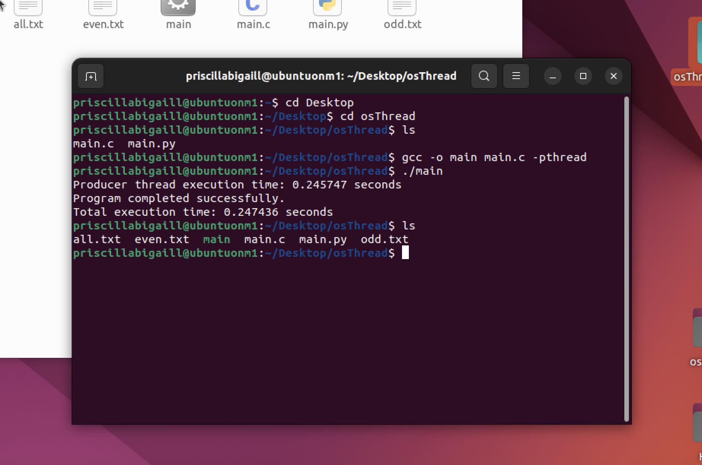

# Operating Systems: Multi-threaded Program 

Priscilla Abigail Munthe - 2602109883

## To run

Compile the code:
```
gcc -o main main.c -pthread
```

Run the program:
```
./main
```

The result will look like:


